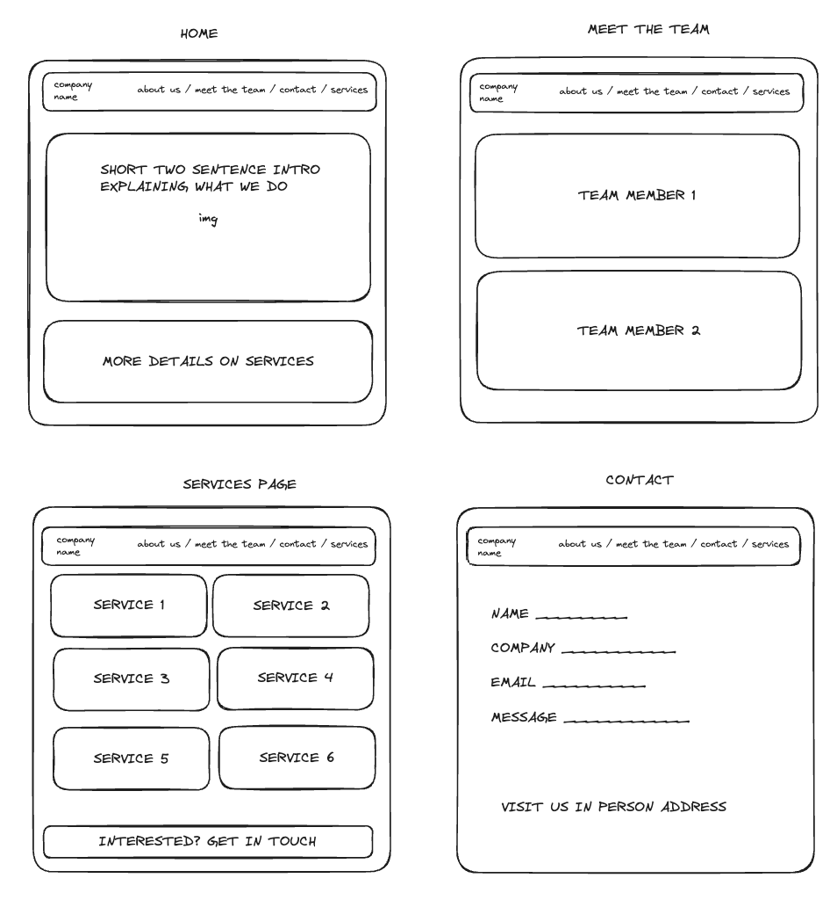
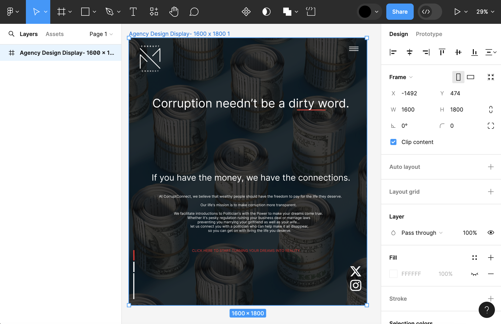

# Lucy-and-Cat-Agency
# readMe

## Description:

The goal of the first project on the Founders and Coders Software Foundation course was to create an Agency website using Vanilla JavaScript. 

### Time frame:

We completed this project in two weeks

### Software Used:

- Javascript, HTML, CSS
- Figma
- Excalidraw
- Github Projects 
- Canva
- Illustrator

## Brief

The website needed to: 

- Include an introduction to the Agency
- Include information about each member of the team
- Include a way to get in touch with the Agency
- Have fully Responsive Design
- Site Navigation
- Be fully accessible 

## Planning

We started by creating a wireframe of the website.

The Wireframe:
 

Once we had the wireframe, we moved to creating the design files via Adobe Illustrator and Canva. We uploaded the files to Figma. 

The Homepage Design on Figma:

## Build Process
The first stage of the build was to get the HTML layout down and then build the CSS. 

Once we had the basic structure in place it was clear that we needed to make some minor amends to the design to better suit a web layout: 

- Images needed to finish sooner so that each page could get to the text sooner
- We extended the height of each page so that the text was larger and therefore more accessible

## Challenges

Lucy: I found the Responsive Design process a challenge as it was new to me. By the end of the project I'd learnt a more methodical way to approach the process 

## Wins and Takeaways

Lucy: I feel proud of the final product as I feel it's of a professional standard. I think we worked well as a team and communicated during any tricky moments so that we kept the workflow going throughout.

## Bugs and Future Improvements

There were a couple of outstanding bugs in the project at the point of submission:
- There's some visual imperfections in the responsive design that would need to be ironed out if this were to be rolled out for a real world client
- The backend of the form has not been added because it was not part of the brief for this project

